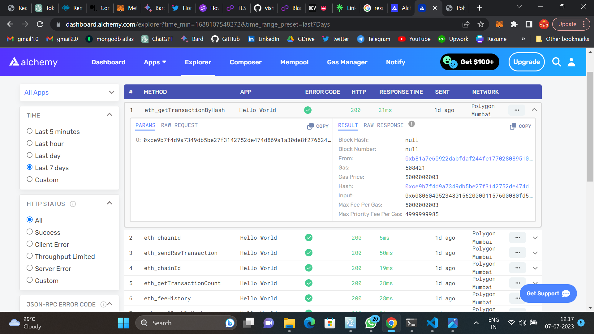

<a name="readme-top"></a>
[![Contributors][contributors-shield]][contributors-url]
[![Forks][forks-shield]][forks-url]
[![Stargazers][stars-shield]][stars-url]
[![Issues][issues-shield]][issues-url]
[![MIT License][license-shield]][license-url]
[![LinkedIn][linkedin-shield]][linkedin-url]
[![github][github-shield]][github-url]
[![Twitter][twitter-shield]][twitter-url]
[![Linktree][linktree-shield]][linktree-url]
[![Instagram][instagram-shield]][instagram-url]

<!-- PROJECT LOGO -->
<br />
<div align="center">
  <!-- <a href="https://github.com/othneildrew/Best-README-Template">
    
  </a> -->

  <h1 align="center">Smart Contract Deployment into Polygon using Hardhat, Solidity, MetaMask and Alchemy</h1>

  <p align="center">
    This project demonstrates the deployment of a smart contract into Polygon Mumbai network using Hardhat, Solidity, MetaMask and Alchemy. The deployment process involves setting up the development environment, writing and testing the smart contract, and deploying it to the Polygon Mumbai Testnet.
    <br />
    <a href="https://wiki.polygon.technology/docs/pos/deploy/alchemy"><strong>How to deploy a smart contract using Alchemy »</strong></a>
    <br />
  </p>
</div>


<!-- TABLE OF CONTENTS -->
<details>
  <summary>Table of Contents</summary>
  <ol>
    <li>
      <a href="#technologies">Technologies used</a>
    </li>
    <li>
      <a href="#prerequisits">Prerequisits</a>
      <!-- <ul>
        <li><a href="#prerequisites">Prerequisites</a></li>
        <li><a href="#installation">Installation</a></li>
      </ul> -->
    </li>
    <li><a href="#getting-started">Getting started</a></li>
    <li><a href="#contributing">Contributing</a></li>
    <li><a href="#additional-resources">Additional Resources</a></li>
  </ol>
</details>

## Technologies used

* Hardhat <br/>
A development environment for Ethereum that facilitates smart contract development, testing, and deployment.
* Solidty <br/>
A programming language for writing smart contracts on the Ethereum platform.
* Metamask <br/>
A browser extension wallet that allows interactions with Ethereum networks and decentralized applications.
* Polygon Mumbai Testnetwork <br/>
A test network provided by Polygon (previously Matic) for Ethereum-compatible smart contracts.
* Alchemy <br/>
A blockchain infrastructure provider that offers powerful APIs for interacting with Ethereum networks.

## Prerequisits
1. Install Node.js: <br>
Make sure you have Node.js installed on your machine. You can download it from the official Node.js website.

2. Install MetaMask:  <br>
Install the MetaMask extension for your browser and set up an account. Make sure you have some test Ether (MATIC) on the Polygon Mumbai Testnet.

3. Obtain Alchemy API Key: <br>
Sign up on the Alchemy website and obtain an API key. This key will be used to connect to the Polygon Mumbai Testnet.

<!-- GETTING STARTED -->
## Getting Started

This is an example of how you may give instructions on setting up your project locally.
To get a local copy up and running follow these simple example steps.

### 1. Initialize your project

First, we’ll need to create a folder for our project. Navigate to your command line and type:
  ```sh
  mkdir hello-world
  cd hello-world
  ```

### 2. Installation

Now that we’re inside our project folder, we’ll use npm init to initialize the project.

intialize node package manager
   ```sh
   npm init -y
   ```

### 3. Install Hardhat

Hardhat is a development environment to compile, deploy, test, and debug your Ethereum software. 
Globally install hardhat if it doesn't exist
  ```sh
  npm install --save-dev hardhat
  ```

### 4. Create Hardhat project
```sh
npx hardhat
```
generate an empty hardhat.config.js project

### 5. Add project folders
Navigate to the root folder in the command line and type
```sh
mkdir contracts
mkdir scripts
```
* contracts/ is where we’ll keep our hello world smart contract code file
* scripts/ is where we’ll keep scripts to deploy and interact with our contract

### 6. Write the contract

1. navigate to the contracts folder and create Helloworld.sol
2. Copy and paste this code into your Helloworld.sol file
```sh
// SPDX-License-Identifier: None
pragma solidity >=0.8.9;
contract HelloWorld {
    event UpdatedMessages(string oldStr, string newStr);
    string public message;
    constructor(string memory initMessage) {
        message = initMessage;
    }
    function update(string memory newMessage) public {
        string memory oldMsg = message;
        message = newMessage;
        emit UpdatedMessages(oldMsg, newMessage);
    }
}
```

### 7. Connect with metamask and Alchemy
Install the dotenv package in the root directory
```sh
npm install dotenv --save
```
Your .env should look like this:
```sh
API_URL = "https://polygon-mumbai.g.alchemy.com/v2/your-api-key"
PRIVATE_KEY = "your-metamask-private-key"
```

### 8. Install ethers.js
```sh
npm install --save-dev @nomiclabs/hardhat-ethers "ethers@^5.0.0"
```

### 9. Update hardhat.config.js
```sh
/**
* @type import('hardhat/config').HardhatUserConfig
*/

require('dotenv').config();
require("@nomiclabs/hardhat-ethers");

const { API_URL, PRIVATE_KEY } = process.env;

module.exports = {
   solidity: "0.8.9",
   defaultNetwork: "polygon_mumbai",
   networks: {
      hardhat: {},
      polygon_mumbai: {
         url: API_URL,
         accounts: [`0x${PRIVATE_KEY}`]
      }
   },
}
```

### 10. Compile the smart contract
```sh
npx hardhat compile
```
### 11. Write our deploy script
navigate to the scripts folder and create deploy.js
```sh
async function main() {
  const HelloWorld = await ethers.getContractFactory("HelloWorld");
  const hello_world = await HelloWorld.deploy("Hello World!");
  console.log("Contract deployed to address:", hello_world.address);
}

main()
  .then(() => process.exit(0))
  .catch((error) => {
    console.error(error);
    process.exit(1);
  });
```

### 12. Deploy your smart contracts
```sh
npx hardhat run scripts/deploy.js --network polygon_mumbai
```
You should see something like this:
```sh
Contract deployed to address: 0x3d94af870ED272Cd5370e4135F9B2Bd0e311d65D
```
Go to the [polygon mumbai explorer](https://mumbai.polygonscan.com/) and search for your smart contract

## Screenshots
<a href="https://github.com/othneildrew/Best-README-Template">
    
</a><br>
Transaction details on alchemy


<!-- CONTRIBUTING -->
## Contributing

Contributions are what make the open source community such an amazing place to learn, inspire, and create. Any contributions you make are **greatly appreciated**.

If you have a suggestion that would make this better, please fork the repo and create a pull request. You can also simply open an issue with the tag "enhancement".
Don't forget to give the project a star! Thanks again!

1. Fork the Project
2. Create your Feature Branch (`git checkout -b feature/AmazingFeature`)
3. Commit your Changes (`git commit -m 'Add some AmazingFeature'`)
4. Push to the Branch (`git push origin feature/AmazingFeature`)
5. Open a Pull Request

## Additional Resources
* [Hardhat Documentation](https://hardhat.org/docs)
* [Solidity Documentation](https://docs.soliditylang.org/en/v0.8.20/)
* [MetaMask Documentation](https://docs.metamask.io/)
* [Polygon Mumbai Testnet Documentation](https://docs.polygonscan.com/v/mumbai-polygonscan/)
* [Alchemy Documentation](https://docs.alchemy.com/)

<!-- MARKDOWN LINKS & IMAGES -->
<!-- https://www.markdownguide.org/basic-syntax/#reference-style-links -->
[contributors-shield]: https://img.shields.io/github/contributors/othneildrew/Best-README-Template.svg?style=for-the-badge
[contributors-url]: https://github.com/vishnusureshperumbavoor/polygon_mumbai_smart_contract/graphs/contributors

[forks-shield]: https://img.shields.io/github/forks/othneildrew/Best-README-Template.svg?style=for-the-badge
[forks-url]: https://github.com/vishnusureshperumbavoor/polygon_mumbai_smart_contract/network/members

[stars-shield]: https://img.shields.io/github/stars/othneildrew/Best-README-Template.svg?style=for-the-badge
[stars-url]: https://github.com/vishnusureshperumbavoor/polygon_mumbai_smart_contract/stargazers

[issues-shield]: https://img.shields.io/github/issues/othneildrew/Best-README-Template.svg?style=for-the-badge
[issues-url]: https://github.com/vishnusureshperumbavoor/polygon_mumbai_smart_contract/issues

[license-shield]: https://img.shields.io/github/license/othneildrew/Best-README-Template.svg?style=for-the-badge
[license-url]: https://github.com/vishnusureshperumbavoor/polygon_mumbai_smart_contract/blob/master/LICENSE.txt

[product-screenshot]: images/screenshot.png

[linkedin-shield]: https://img.shields.io/badge/LinkedIn-0077B5?style=for-the-badge&logo=linkedin&logoColor=white
[linkedin-url]: https://www.linkedin.com/in/vishnu-suresh-perumbavoor/

[twitter-shield]: https://img.shields.io/badge/Twitter-1DA1F2?style=for-the-badge&logo=twitter&logoColor=white
[twitter-url]: https://twitter.com/in/vspeeeeee

[instagram-shield]: https://img.shields.io/badge/Instagram-E4405F?style=for-the-badge&logo=instagram&logoColor=white
[instagram-url]: https://www.instagram.com/vishnusureshperumbavoor/

[linktree-shield]: https://img.shields.io/badge/linktree-39E09B?style=for-the-badge&logo=linktree&logoColor=white
[linktree-url]: https://linktr.ee/vishnusureshperumbavoor2.0

[github-shield]: https://img.shields.io/badge/GitHub-100000?style=for-the-badge&logo=github&logoColor=white
[github-url]: https://github.com/vishnusureshperumbavoor
